# Infraestructura GCP & Google Workspace — Periodo de Prueba Técnica Turing IA

## Descripción
Infraestructura GCP con Cloud Storage, Cloud Functions y automatización 
en Google Workspace — Periodo de prueba técnica Turing IA.

## Arquitectura


---

## DÍA 1 — Configuración de infraestructura GCP

### 1. Proyecto GCP
Se creó el proyecto `turing-gcp-test` en Google Cloud Platform.


### 2. APIs habilitadas
Se habilitaron las APIs necesarias para el proyecto.


### 3. IAM
Se configuró un usuario de prueba con el rol de Visualizador de objetos 
de Storage, aplicando el principio de privilegios mínimos.


### 4. Bucket
Se creó el bucket `bucket-turing-prueba` en us-central1 con clase Standard,
control de acceso uniforme y prevención de acceso público activada.


### 5. Ciclo de vida
Se configuró una regla para eliminar objetos con más de 30 días de antigüedad.


### 6. Permisos del bucket
Se asignaron permisos de lectura al usuario de prueba. 
La cuenta principal tiene acceso total al proyecto por su rol de propietario.


### 7. Cloud Function
Se desplegó una Cloud Function en Python 3.11 que se activa automáticamente 
cuando se sube un archivo al bucket, extrae sus metadatos y los registra 
en Cloud Logging.


### Prueba end-to-end
Se subió un archivo de prueba al bucket y se verificó que la Cloud Function 
se activó correctamente y registró los metadatos en Cloud Logging.


### Pruebas unitarias
Se implementaron 3 pruebas unitarias verificando el flujo exitoso, 
campos faltantes y manejo de errores.


---

## DÍA 2 — Automatización en Google Workspace

### 1. Simulación del entorno de Google Workspace

Se simuló un entorno de Google Workspace mediante Google Groups,
configurando grupos de usuarios, asignación de roles y políticas
básicas de seguridad y permisos.

#### Google Groups
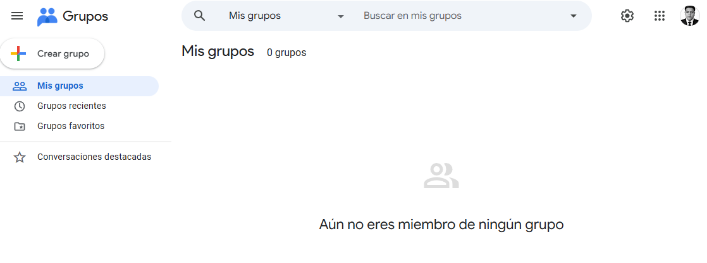
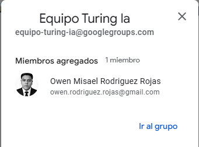
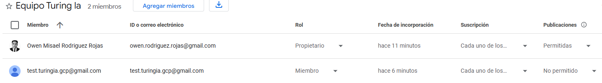

### 2. Google Sheet — Sistema de Gestión de Tareas

Se creó un Google Sheet con estructura de datos para gestionar tareas
del equipo, incluyendo responsable, email, fecha límite, estado,
días restantes y control de eventos y alertas.

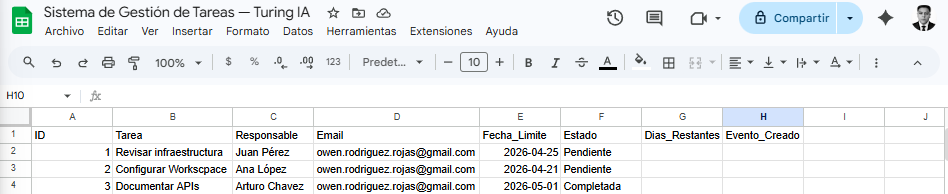

### 3. Google Apps Script

Se desarrolló un script avanzado en Google Apps Script que integra
tres servicios de Google Workspace de forma automática:

- **Google Sheets** — Lee datos, calcula días restantes y actualiza registros
- **Gmail** — Envía alertas cuando una tarea está próxima a vencer
- **Google Calendar** — Crea eventos automáticamente en la fecha límite de cada tarea

El script incluye control de alertas duplicadas mediante la columna
`Alerta_Enviada`, garantizando que cada tarea reciba solo una notificación.

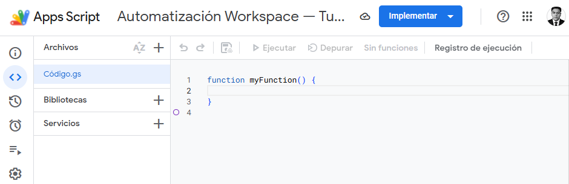
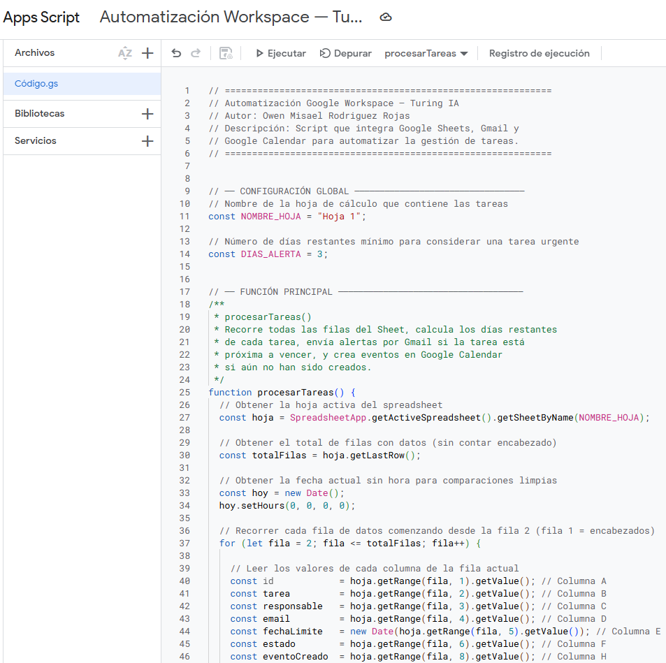
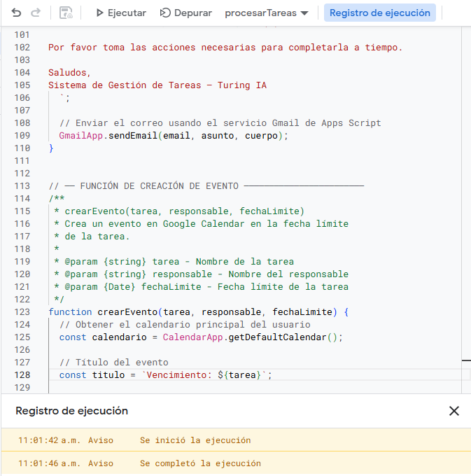

### 4. Triggers configurados

Se configuraron dos activadores automáticos:

- **Trigger diario** — Ejecuta el script todos los días entre 9:00 y 10:00 am
- **Trigger por edición** — Ejecuta el script automáticamente al editar el Sheet

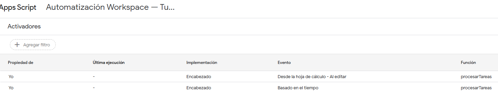

### 5. Pruebas de funcionamiento

Se realizaron pruebas simulando la adición de nuevas filas al Sheet,
verificando que el sistema respondió automáticamente en los tres servicios.

#### Sheet actualizado automáticamente
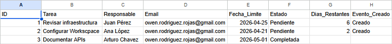

#### Notificación recibida en Gmail
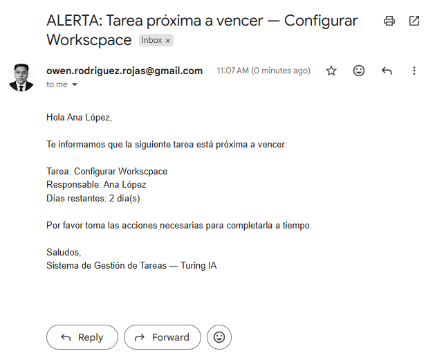

#### Evento creado en Google Calendar
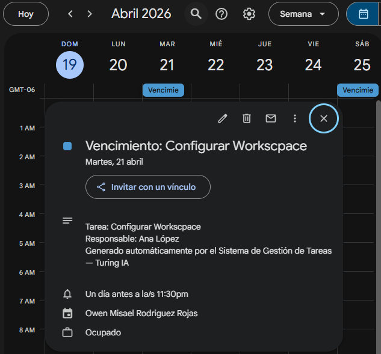

#### Prueba con fila nueva — trigger automático
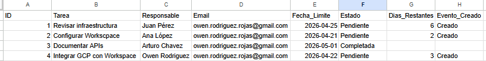
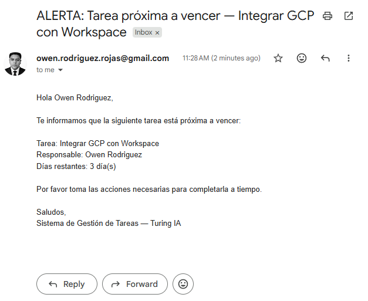
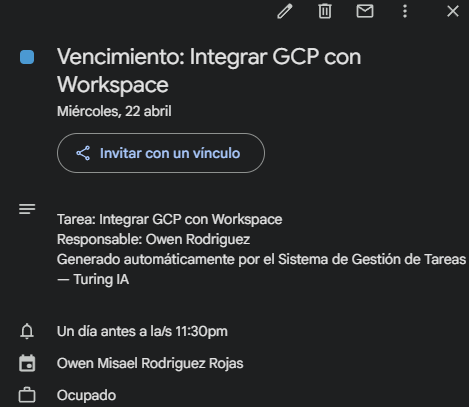

#### Corrección de bug — alertas duplicadas
Se identificó y corrigió un bug donde el script enviaba alertas repetidas
a todas las tareas próximas a vencer en cada ejecución. Se implementó
una columna de control `Alerta_Enviada` que garantiza una sola notificación
por tarea.

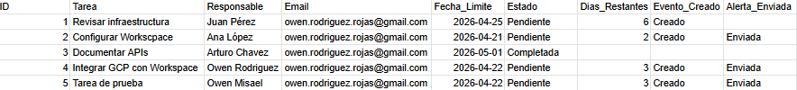
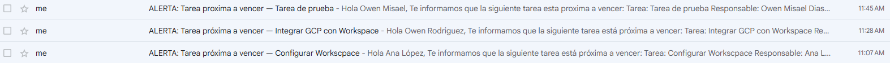

---

## Estructura del repositorio
```
turing-gcp-workspace-prueba/
├── README.md
├── cloud-function/
│   ├── main.py
│   ├── requirements.txt
│   └── test_main.py
├── workspace-automation/
│   └── codigo.gs
└── docs/
    └── capturas/
        ├── Dia1/
        └── Dia2/
```