# Infraestructura GCP & Google Workspace — Periodo de Prueba Técnica Turing IA

## Descripción
Infraestructura GCP con Cloud Storage, Cloud Functions y automatización 
en Google Workspace — Periodo de prueba técnica Turing IA.

## Arquitectura
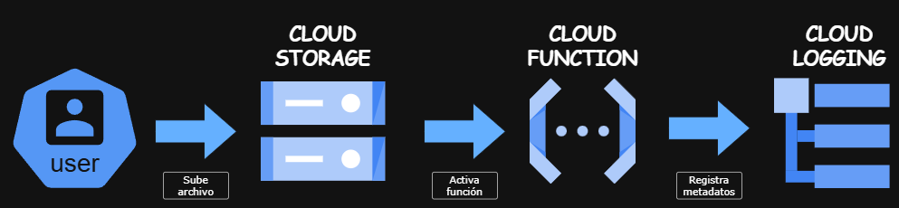

---

## DÍA 1 — Configuración de infraestructura GCP

### 1. Proyecto GCP
Se creó el proyecto `turing-gcp-test` en Google Cloud Platform.

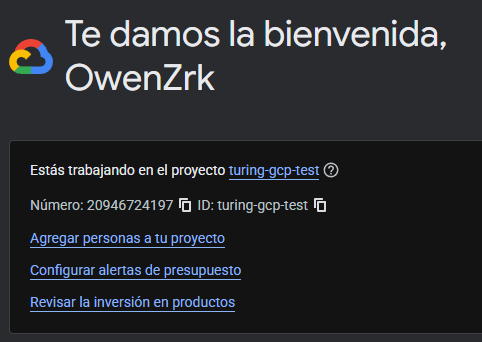

### 2. APIs habilitadas
Se habilitaron las APIs necesarias para el proyecto.

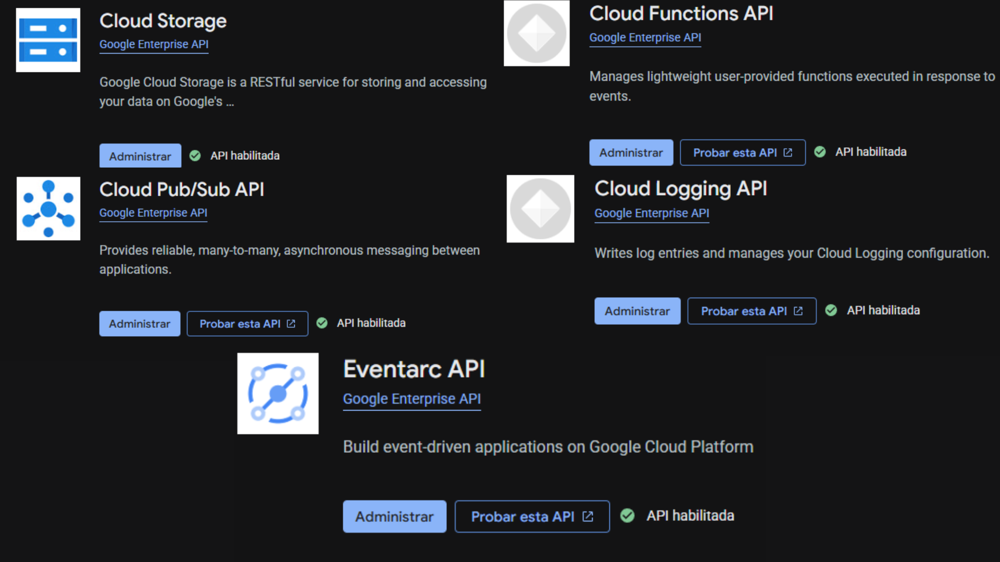

### 3. IAM
Se configuró un usuario de prueba con el rol de Visualizador de objetos 
de Storage, aplicando el principio de privilegios mínimos.

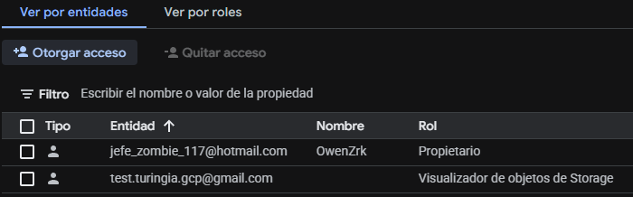

### 4. Bucket
Se creó el bucket `bucket-turing-prueba` en us-central1 con clase Standard,
control de acceso uniforme y prevención de acceso público activada.

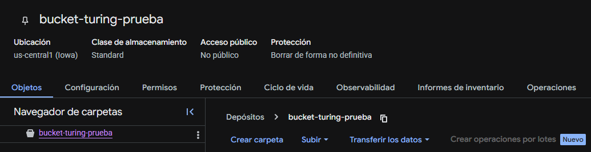

### 5. Ciclo de vida
Se configuró una regla para eliminar objetos con más de 30 días de antigüedad.

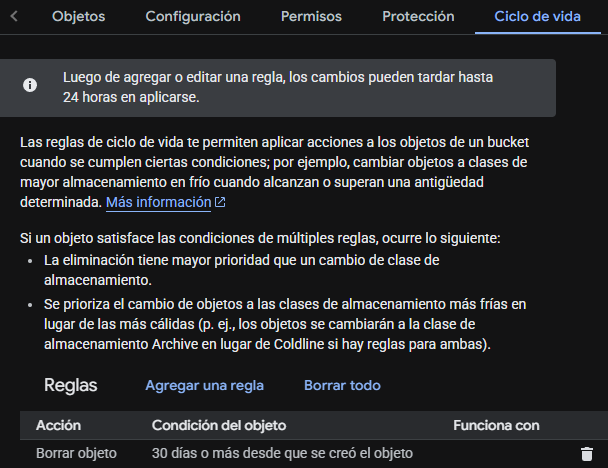

### 6. Permisos del bucket
Se asignaron permisos de lectura al usuario de prueba. 
La cuenta principal tiene acceso total al proyecto por su rol de propietario.

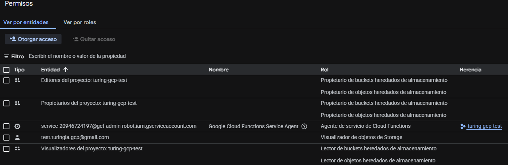

### 7. Cloud Function
Se desplegó una Cloud Function en Python 3.11 que se activa automáticamente 
cuando se sube un archivo al bucket, extrae sus metadatos y los registra 
en Cloud Logging.

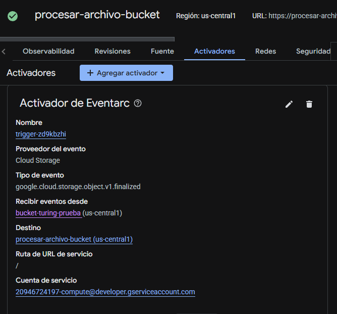
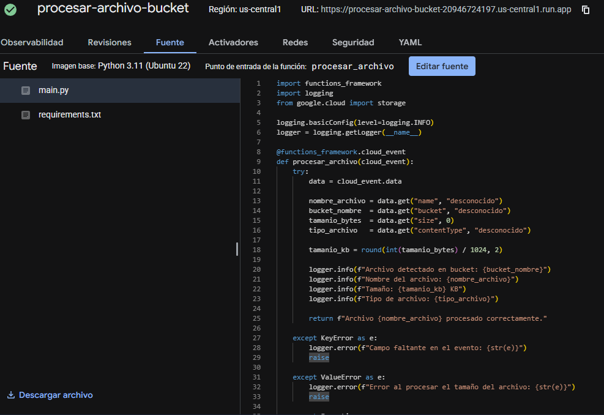

### Prueba end-to-end
Se subió un archivo de prueba al bucket y se verificó que la Cloud Function 
se activó correctamente y registró los metadatos en Cloud Logging.

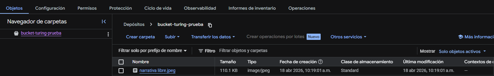
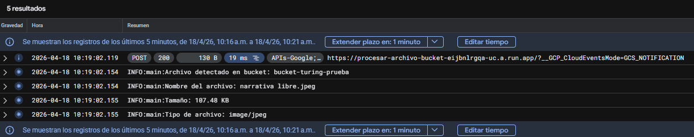

### Pruebas unitarias
Se implementaron 3 pruebas unitarias verificando el flujo exitoso, 
campos faltantes y manejo de errores.

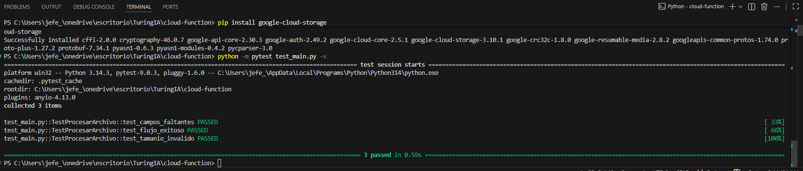

---

## DÍA 2 — Automatización en Google Workspace

*(En construcción — se actualizará al completar el Día 2)*

---

## Estructura del repositorio
```
turing-gcp-workspace-prueba/
├── README.md
├── cloud-function/
│   ├── main.py
│   ├── requirements.txt
│   └── test_main.py
├── workspace-automation/
│   └── codigo.gs
└── docs/
    └── capturas/
        ├── dia1/
        └── dia2/
```
