# Infraestructura GCP & Google Workspace — Periodo de Prueba Técnica Turing IA

## Descripción
Infraestructura GCP con Cloud Storage, Cloud Functions y automatización 
en Google Workspace — Periodo de prueba técnica Turing IA.

## Arquitectura
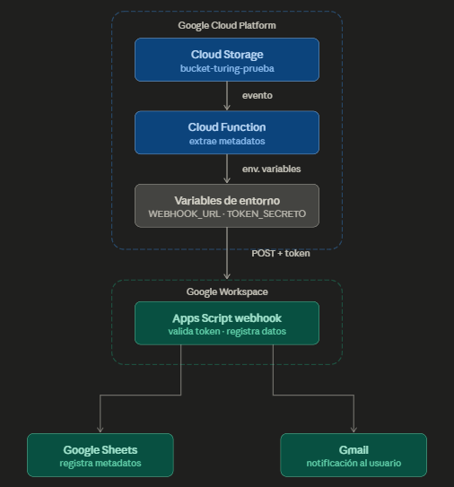

---

## DÍA 1 — Configuración de infraestructura GCP

### 1. Proyecto GCP
Se creó el proyecto `turing-gcp-test` en Google Cloud Platform.


### 2. APIs habilitadas
Se habilitaron las APIs necesarias para el proyecto.


### 3. IAM
Se configuró un usuario de prueba con el rol de Visualizador de objetos 
de Storage, aplicando el principio de privilegios mínimos.


### 4. Bucket
Se creó el bucket `bucket-turing-prueba` en us-central1 con clase Standard,
control de acceso uniforme y prevención de acceso público activada.


### 5. Ciclo de vida
Se configuró una regla para eliminar objetos con más de 30 días de antigüedad.


### 6. Permisos del bucket
Se asignaron permisos de lectura al usuario de prueba. 
La cuenta principal tiene acceso total al proyecto por su rol de propietario.


### 7. Cloud Function
Se desplegó una Cloud Function en Python 3.11 que se activa automáticamente 
cuando se sube un archivo al bucket, extrae sus metadatos y los registra 
en Cloud Logging.


### Prueba end-to-end
Se subió un archivo de prueba al bucket y se verificó que la Cloud Function 
se activó correctamente y registró los metadatos en Cloud Logging.


### Pruebas unitarias
Se implementaron 3 pruebas unitarias verificando el flujo exitoso, 
campos faltantes y manejo de errores.


### Diagrama de flujo — Día 1


---

## DÍA 2 — Automatización en Google Workspace

### 1. Simulación del entorno de Google Workspace

Se simuló un entorno de Google Workspace mediante Google Groups,
configurando grupos de usuarios, asignación de roles y políticas
básicas de seguridad y permisos.

#### Google Groups


### 2. Google Sheet — Sistema de Gestión de Tareas

Se creó un Google Sheet con estructura de datos para gestionar tareas
del equipo, incluyendo responsable, email, fecha límite, estado,
días restantes y control de eventos y alertas.


### 3. Google Apps Script

Se desarrolló un script avanzado en Google Apps Script que integra
tres servicios de Google Workspace de forma automática:

- **Google Sheets** — Lee datos, calcula días restantes y actualiza registros
- **Gmail** — Envía alertas cuando una tarea está próxima a vencer
- **Google Calendar** — Crea eventos automáticamente en la fecha límite de cada tarea

El script incluye control de alertas duplicadas mediante la columna
`Alerta_Enviada`, garantizando que cada tarea reciba solo una notificación.


### 4. Triggers configurados

Se configuraron dos activadores automáticos:

- **Trigger diario** — Ejecuta el script todos los días entre 9:00 y 10:00 am
- **Trigger por edición** — Ejecuta el script automáticamente al editar el Sheet


### 5. Pruebas de funcionamiento

Se realizaron pruebas simulando la adición de nuevas filas al Sheet,
verificando que el sistema respondió automáticamente en los tres servicios.

#### Sheet actualizado automáticamente


#### Notificación recibida en Gmail


#### Evento creado en Google Calendar


#### Prueba con fila nueva — trigger automático


#### Corrección de bug — alertas duplicadas
Se identificó y corrigió un bug donde el script enviaba alertas repetidas
a todas las tareas próximas a vencer en cada ejecución. Se implementó
una columna de control `Alerta_Enviada` que garantiza una sola notificación
por tarea.


---

## DÍA 3 — Integración completa, seguridad y despliegue

### Objetivo
Conectar los servicios de GCP y Google Workspace en un flujo de trabajo
completo y seguro: desde la subida de un archivo al bucket hasta el registro
de metadatos en Google Sheets y el envío de una notificación por Gmail.

### 1. Google Sheet — Registro de archivos GCP

Se creó un nuevo Google Sheet con las columnas necesarias para registrar
los metadatos enviados desde Cloud Storage.

| Columna | Descripción |
|---|---|
| `Nombre_Archivo` | Nombre del archivo subido al bucket |
| `Tamaño_Bytes` | Tamaño en bytes |
| `Tipo_Contenido` | MIME type del archivo |
| `Bucket` | Nombre del bucket de origen |
| `Fecha_Recepcion` | Timestamp de recepción en Apps Script |

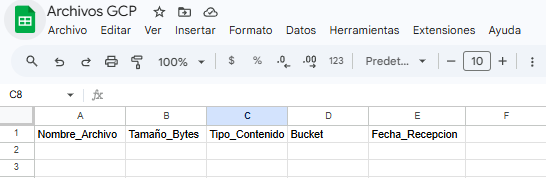

### 2. Webhook en Apps Script

Se desarrolló un endpoint HTTP en Google Apps Script (`webhook.gs`) desplegado
como Web App, que recibe los metadatos enviados por la Cloud Function.

El webhook implementa las siguientes medidas de seguridad y validación:

- Validación de token secreto compartido (`TOKEN_SECRETO`)
- Verificación de campos obligatorios (`nombre_archivo`, `bucket`)
- Manejo de errores con respuestas JSON estructuradas
- Almacenamiento del token en Script Properties (nunca en el código)

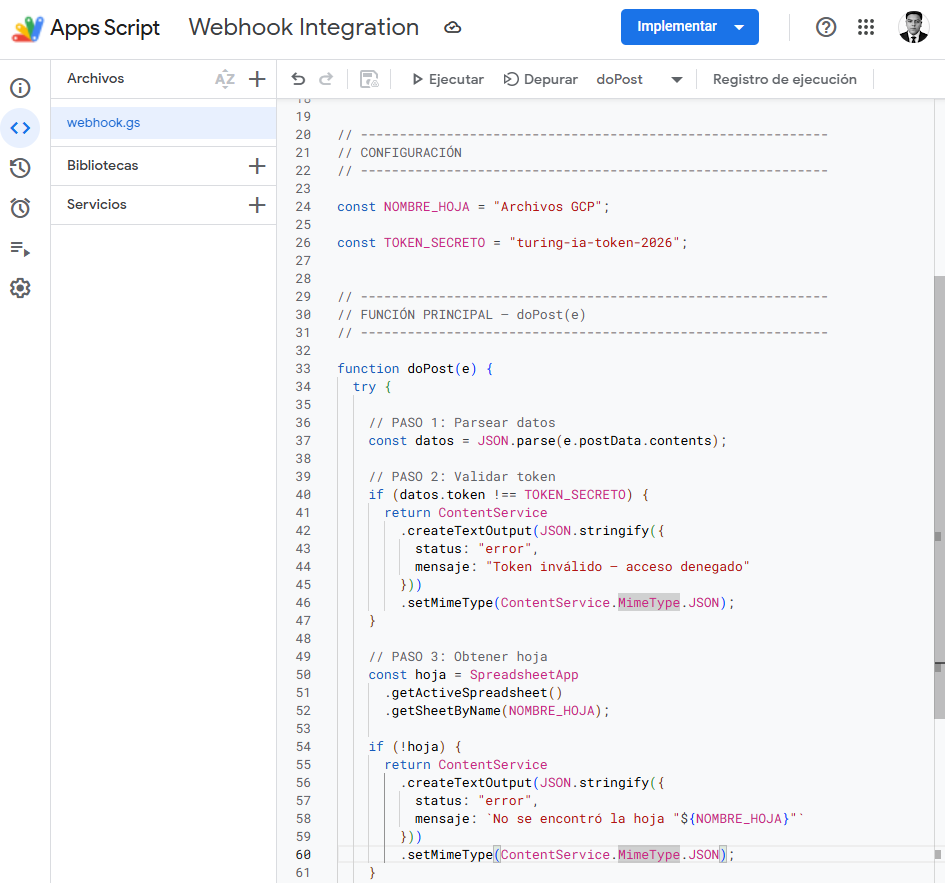
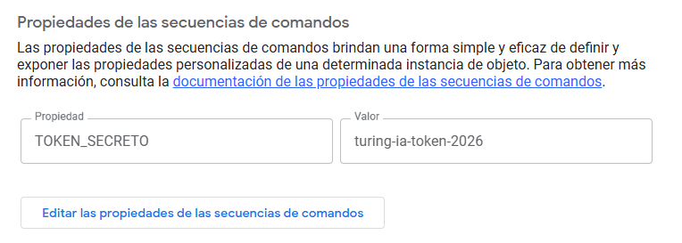
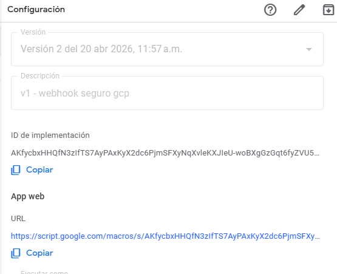

### 3. Actualización de la Cloud Function

Se modificó la Cloud Function del Día 1 para integrarla con el webhook.
Los cambios principales fueron:

- Lectura de `WEBHOOK_URL` y `TOKEN_SECRETO` desde variables de entorno
- Construcción del payload con metadatos del archivo
- Envío del POST al webhook de Apps Script con timeout de 10 segundos
- Validación del código de respuesta y logging del resultado

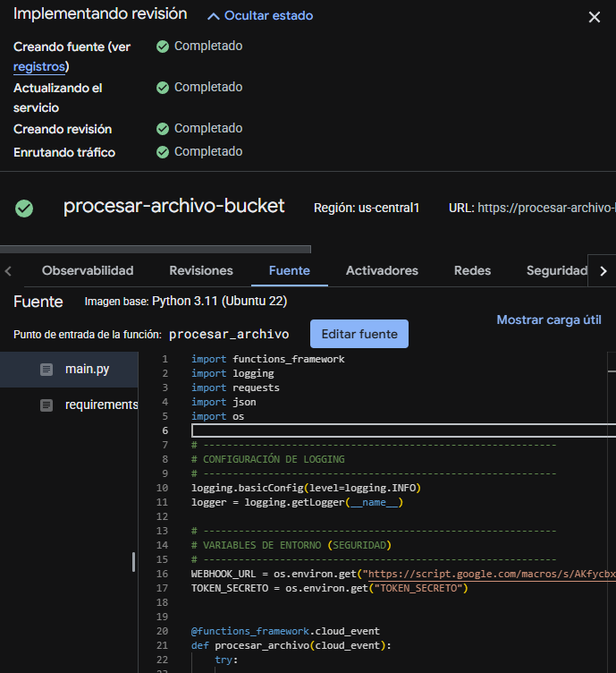

### 4. Variables de entorno en Cloud Run

Se configuraron las variables de entorno necesarias en el servicio de Cloud Run
que ejecuta la Cloud Function, garantizando que las credenciales no queden
expuestas en el código fuente.

| Variable | Descripción |
|---|---|
| `WEBHOOK_URL` | URL pública del webhook de Apps Script |
| `TOKEN_SECRETO` | Token de autenticación compartido |

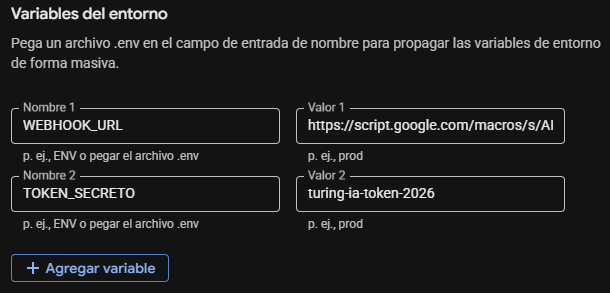

### 5. Corrección del webhook y versionado

Durante las pruebas se detectaron errores en la versión inicial del webhook.
Se realizaron correcciones y se generaron nuevas versiones del despliegue.

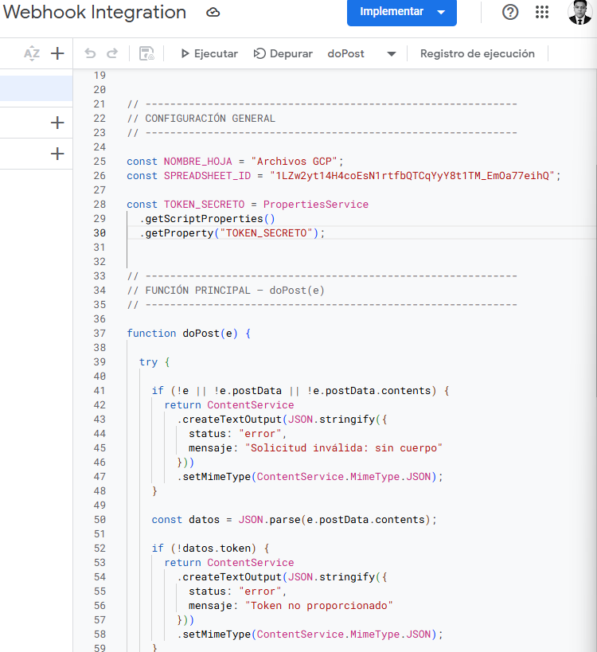
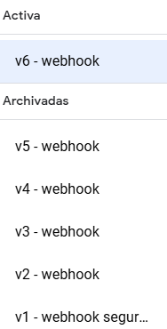

### 6. Pruebas de integración

Se realizaron pruebas end-to-end subiendo múltiples archivos al bucket y
verificando el flujo completo en cada servicio.

#### Sheet con datos registrados
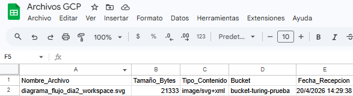

#### Notificación recibida en Gmail
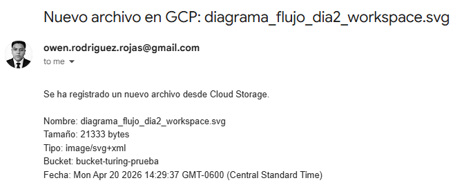

#### Logs del evento de integración en Cloud Logging
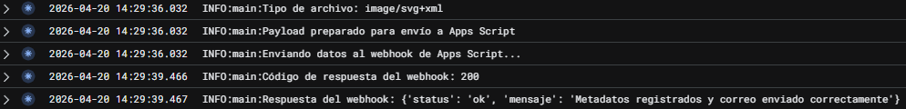

#### Prueba con múltiples archivos
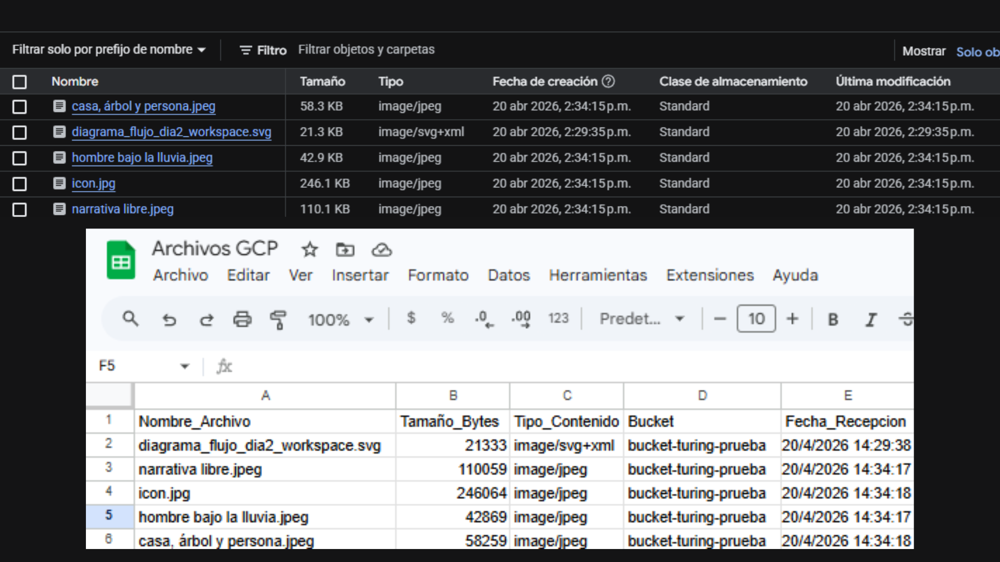

#### IAM — Service Account de Cloud Function
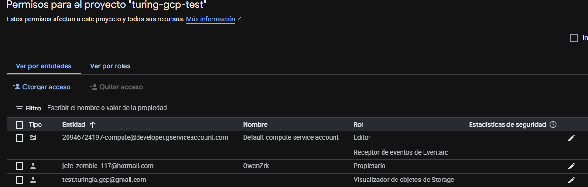

### 7. Incidencia detectada y resuelta

Al desplegar la versión actualizada de la Cloud Function por primera vez,
antes de configurar las variables de entorno en Cloud Run, se detectaron
errores `POST 500` con el mensaje `Faltan variables de entorno`. El sistema
no podía conectarse al webhook porque `WEBHOOK_URL` y `TOKEN_SECRETO` aún
no existían en el entorno de ejecución. Se resolvió agregándolas desde la
consola de GCP en la configuración del servicio, tras lo cual el flujo
funcionó correctamente.

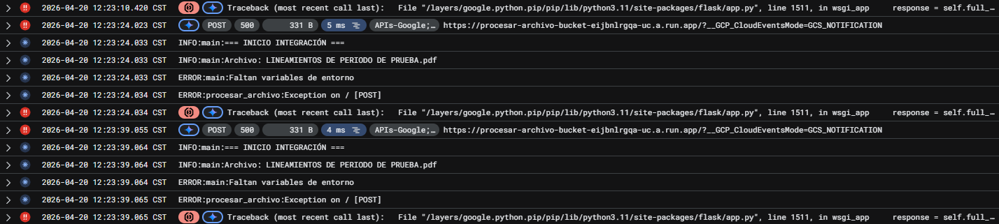

### 8. Diagrama de arquitectura

Flujo completo del sistema integrado:


---

## Estructura del repositorio
```
turing-gcp-workspace-prueba/
├── README.md
├── cloud-function/
│   ├── main.py
│   ├── requirements.txt
│   └── test_main.py
├── workspace-automation/
│   ├── codigo.gs
│   └── webhook.gs
└── docs/
    └── capturas/
        ├── Dia1/
        ├── Dia2/
        └── Dia3/
```
